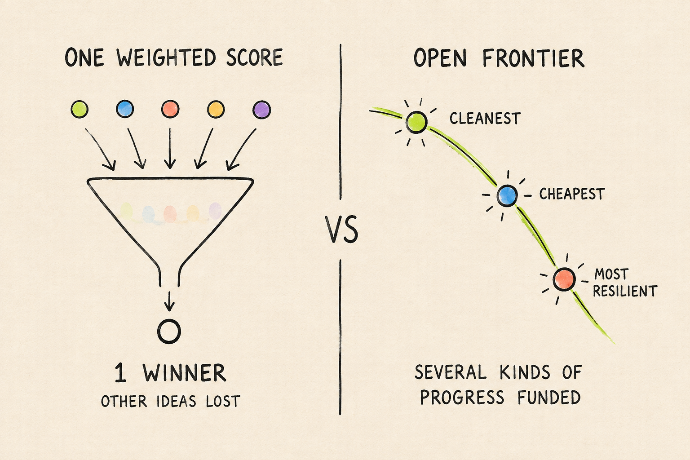

# Value Decentralization

[English](README.md)

## 「何がより良いか」を、誰が決めるのでしょうか？

多くの仕組みは、その判断を一つの重み付きスコアに埋め込んでいます。**Value Decentralizationは、価値判断を複数の主体に開きます。**

複数の「進歩の定義」を共存させるEvaluation Protocol。結果を共通条件で測定し、Tradeoffを残し、独立した **Value Pool** が何を支援するかを決めます。

**測定は一度。トレードオフは残す。価値判断は、それぞれに。**

**[デモを試す](https://web-rho-seven-d6te7t3f0y.vercel.app/arenas/emergency-supply)**



_概念図：すべての結果を一つの総合点に押し込めず、有効な選択肢を残します。_

## 60秒で違いを体験する

最初は、物資供給をシミュレーションする **72-Hour Disaster Response** を開いてください。

1. **戦略を選ぶ。** 5つの供給元、4つの輸送ルート、4つの地域へ、どう物資を届けるか決めます。
2. **トレードオフを見る。** 7つの障害シナリオで、費用・最悪時の配送量・最も届きにくい地域のカバー率を別々に測ります。
3. **Value Poolを比べる。** 効率性・強靱性・公平性の各Poolが、同じ証拠に異なる配分ルールを適用します。Frontier Expansion Poolは新しいトレードオフを支援します。

安い戦略が、最も被害の大きい地域にも十分に届けられるとは限りません。その違いを総合点で消さずに残します。トレードオフに応じて、各Poolの配分プレビューがどう変わるか体験してください。

## 技術的に何が違うのか？

- **同じ条件で比較し、結果を再現する。** 正しさは合否の必須条件です。評価器・データ・制約・指標を共通の評価条件とし、提出物と結果をハッシュで結びます。条件が一致する結果だけを比較します。
- **価値判断は独立、計算は決定論的。** [比較エンジン](packages/shared/src/multiobjective.ts)は、指標の大小の方向、Paretoのトレードオフ、最大6次元の厳密なHypervolume、提出順に依存しない貢献度を扱います。
- **自己申告ではなく実行から評価する。** Calldata Compressionは、コンパイル済みSolidityデコーダをCancun EVM内で実行します。[AI行動のReplay](packages/rescue-room/src/submission-replay.ts)が再現するのは記録済みの判断とシミュレーション結果であり、LLMの内部思考や新しい推論ではありません。

## なぜEthereumを使うのか？

評価計算はオフチェーンで行います。Ethereumは配分の確定記録と支払いを公開し、「何を確定し、何を送ったか」を第三者が確認できるようにします。

[報酬コントラクト](packages/contracts/src/FrontierRewardPool.sol)は、入金残高を超える予約と同じChallengeへの再コミットを防ぎ、参加者自身による受け取りにも対応します。独立したSepoliaデモでは、[配分のコミット](https://sepolia.etherscan.io/tx/0x96fd7a9d1f4a3bbd2fa7a9ea28d250a16e8eedbaff05b51a4f33e581c3839f2c)、[RewardPaid](https://sepolia.etherscan.io/tx/0xd976a968aefeb66d7e60fba7a9cf64c8711195fc3652aeccc20c7448069ad708)、受取人の **10,000 FDT** の残高増加を記録しています。

FDTはSepolia上のデモ用トークンであり、金銭価値は主張していません。

## Rescue Room：AIが別のAIを雇い、支払った

記録済みのインシデント対応パイロットでは、Commanderが専門Agentを選び、別のモデル呼び出しが分析を提供し、SepoliaのEscrowが **5 rUSD-DEMO** を支払いました。別の未納品注文では **5 rUSD-DEMO** を返金しています。[支払い証跡](Docs/evidence/deployments/sepolia-rescue-service-demo.json)。

購入した分析は、その後のCommanderの3回の判断に使われました。行動をReplayし、ユーザー損失・稼働率・対応費用を比較して、独立したPoolが同じ証拠からどう支援を配分するか確認できます。

パイロットでは、**記録済みの実モデル呼び出しとSepoliaでのサービス支払い**を、Protocol操作のシミュレーションとPool配分プレビューにつないでいます。ウォレットは運営管理です。rUSD-DEMOは金銭価値のないテストトークンで、Practiceのゲーム内クレジットとは区別しています。

## スポンサー連携：実装と証跡へ

| Sponsor             | 役割と実行済みの内容                                                                                                            | コード／証跡                                                                                                                                           |
| ------------------- | ------------------------------------------------------------------------------------------------------------------------------- | ------------------------------------------------------------------------------------------------------------------------------------------------------ |
| **ENSv2 · Sepolia** | Rescueサービスの発見、単一テキストレコードの更新権限の委譲、発見の停止、権限取り消し。7件の取引を記録。                         | [サービス発見](packages/ens-adapter/src/rescue.ts) · [権限操作](scripts/demo-ens-rescue.ts) · [証跡](Docs/evidence/deployments/ensv2-rescue-demo.json) |
| **Chainlink CRE**   | 機密ハンドラで非公開シナリオを評価。公式CRE CLIのローカルシミュレーションで、salt付きレシート、明示的な開示、独立Replayを確認。 | [ハンドラ](workflows/chainlink-cre/rescue-envelope/secret-pack/main.ts) · [証跡](Docs/evidence/deployments/chainlink-cre-private-pack.json)            |
| **Bazantic**        | 外部AIがMCPでAPIを発見し、同じ条件で2つの戦略を評価。ローカル評価器による独立した結果の再現も確認。                             | [Agent連携](apps/api/src/bazantic-rescue-agent.ts) · [証跡](Docs/evidence/deployments/bazantic-rescue-agent-demo.json)                                 |

## 6つのArena、1つのプロトコル

**Disaster Response、Calldata Compression、Microgrid、Secret Gate、Rescue Room、Ocean Commons** の6つのArenaで、一つのプロトコルを検証しています。[6つのArenaを見る](https://web-rho-seven-d6te7t3f0y.vercel.app/#arenas)。

戦略の編集、決定論的なPractice、結果のReplayに加え、記録済みAI・サービス支払い証跡と、独立したSepolia報酬デモを確認できます。

[Architectureと信頼境界](Docs/ARCHITECTURE.md)。

## ローカル起動と結果の再現

Node.js 22以上、pnpm 11.24.0が必要です。

```bash
corepack enable
pnpm install --frozen-lockfile
pnpm dev
```

**APIキー・新しい推論・取引なし**で、記録済みRescueの結果とPool比較を再計算できます。

```bash
pnpm verify:rescue:submission-replay
```

任意のAI・ストレージ・チェーン操作には[環境設定ガイド](Docs/development/guides/ENVIRONMENT.md)を利用してください。全体チェックは `pnpm run ci`（Foundry 1.8.1が必要）。

## 参照資料

[Canvaスライド](https://canva.link/r63xqej7g7c78d3) · [Whitepaper](https://github.com/Jun0908/Decentralized-Value-Whitepaper) · [API仕様](openapi/frontier-v1.yaml) · [Docs目次](Docs/README.md)
