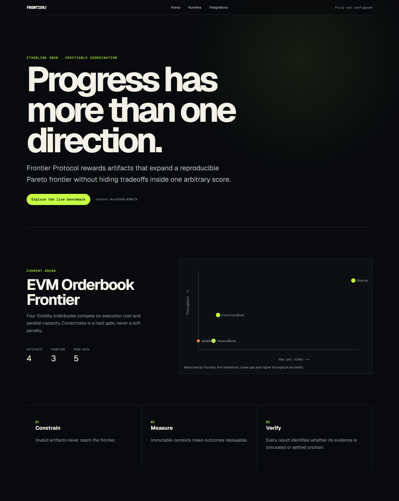
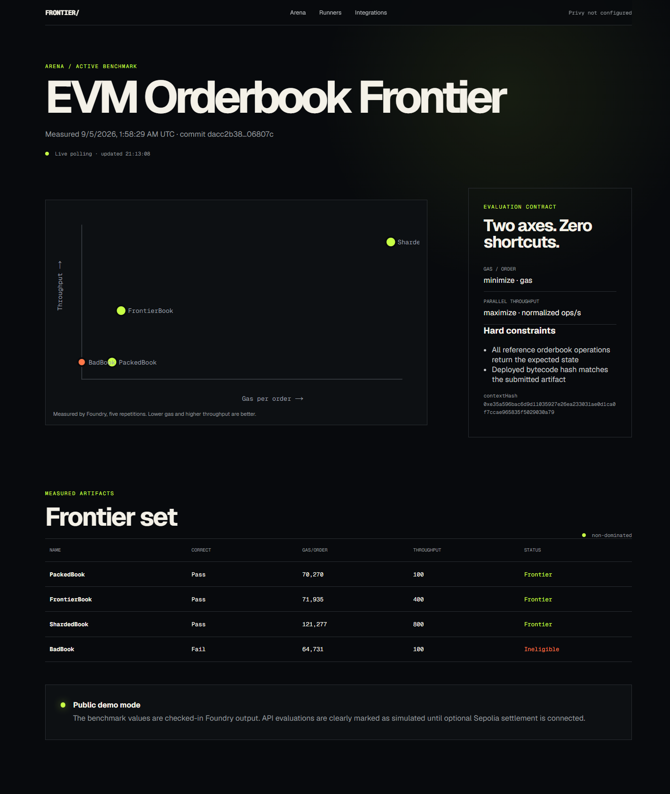
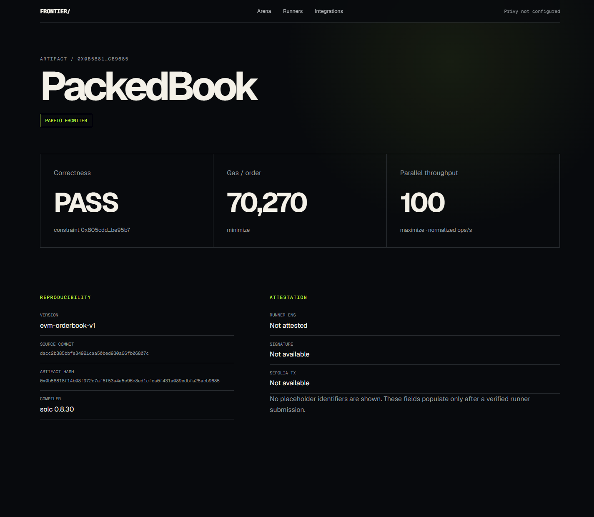
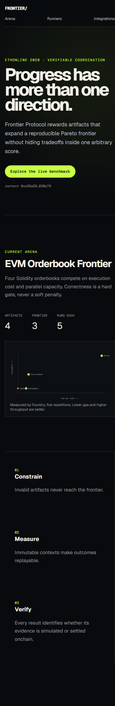

# Frontier Protocol UX audit — 2026-09-06

## Scope

- Production: `https://web-rho-seven-d6te7t3f0y.vercel.app`
- Flow: homepage → live benchmark → artifact detail
- Viewports: 1440×900 desktop and 390×844 mobile
- Goal: determine whether a first-time user immediately understands the product value and what to do next

## Verdict

The deployed site is technically healthy and visually polished, but it currently behaves as a benchmark report rather than a product demo. A user can inspect prepared results, but cannot submit, select, evaluate, or compare an artifact through an explicit task flow. The first screen explains the protocol's philosophy before explaining the user's problem, outcome, or next action.

## Captured flow

### 1. Homepage — healthy rendering, weak task clarity

- Strong visual identity and a clear primary button.
- The headline is memorable but abstract. It does not identify the user, problem, or concrete outcome.
- `artifact`, `Pareto frontier`, and `context` appear before a plain-language example.
- Sponsor-facing navigation and `Privy not configured` compete with the product story.

### 2. Arena — healthy data view, no user action

- The chart and result table make the prepared benchmark inspectable.
- The page does not explain the conclusion in user terms: cheapest, fastest, and balanced implementations can all deserve support.
- `Live polling` is misleading because the timestamp refreshes locally while the benchmark fixture remains unchanged.
- The rows are clickable, but there is no visible affordance or action label.

### 3. Artifact — healthy evidence view, dead end

- Correctness and metrics are presented clearly.
- The page exposes internal evidence before answering why this implementation matters.
- There is no back-to-comparison CTA, `Evaluate this artifact`, share action, or funding/reward outcome.

### 4. Mobile homepage — readable copy, unusable chart

- The hero reflows without clipping.
- The plot becomes too small to compare points or read labels.
- The full page is long because principles stack after the benchmark, while no new action is introduced.
- On the mobile arena table, CSS hides correctness and throughput columns even though they are core to the product.

## Highest-impact changes

1. Replace the abstract hero with the user problem and outcome: stop forcing multi-dimensional work into one score; find every solution that expands what is possible.
2. Make `Run the demo` the primary action. Use a three-step interaction: choose a sample artifact → evaluate it → reveal whether and how it changes the frontier.
3. Explain the current result in plain language above the plot: PackedBook is cheapest, ShardedBook is fastest, FrontierBook is balanced, and all three remain valuable.
4. Move `Runners`, `Integrations`, Privy state, Bazantic details, and sponsor evidence out of the primary product navigation and into GitHub/docs or a secondary technical page.
5. Turn the arena and artifact pages into a connected task. Add visible row affordances, `Compare`, `Evaluate`, and `Back to frontier` actions.
6. Replace the fake-live label with `Sample benchmark` until the page actually refetches changing evaluation state.
7. Design a mobile-specific comparison view instead of shrinking the desktop plot and hiding core table dimensions.

## Accessibility risks visible from this audit

- Chart labels and several mono metadata labels are very small, especially on mobile.
- Frontier/ineligible state relies heavily on lime/orange color; add shape or textual markers inside the plot.
- Custom table roles lack explicit column-header and cell semantics.
- Muted text may need contrast measurement against the dark background.
- Screenshot inspection cannot confirm screen-reader output, full keyboard order, zoom behavior, or measured WCAG contrast.

## Recommended first implementation slice

Build one convincing `/demo` flow before adding more protocol surfaces. It should start with a relatable decision, let the user run one sample evaluation without setup or payment, animate the point entering the plot, and end with a plain-language frontier decision plus inspectable evidence. Keep sponsor integrations in GitHub and make the product UI about the user's outcome.
