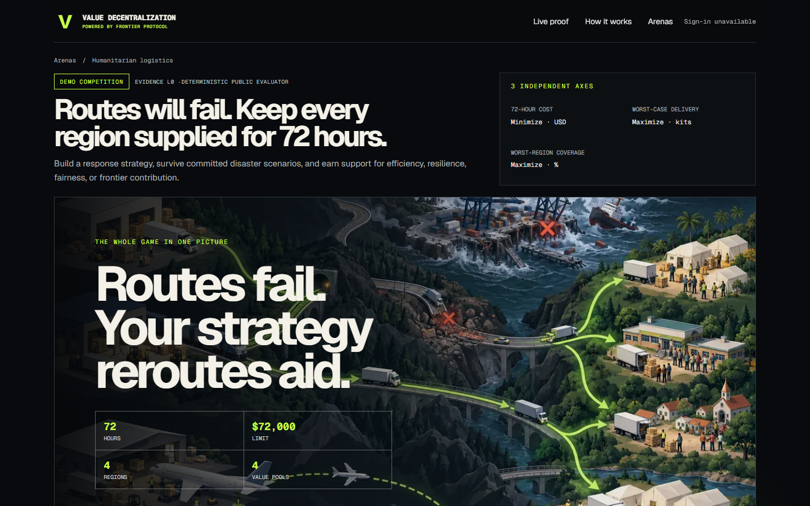
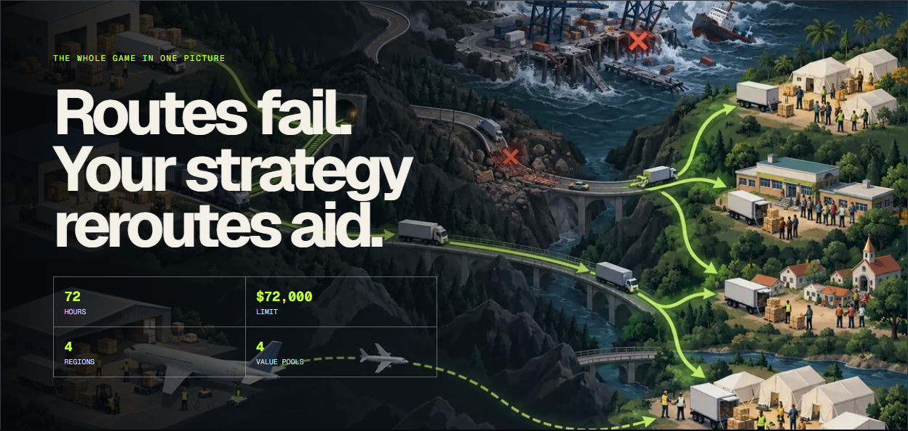
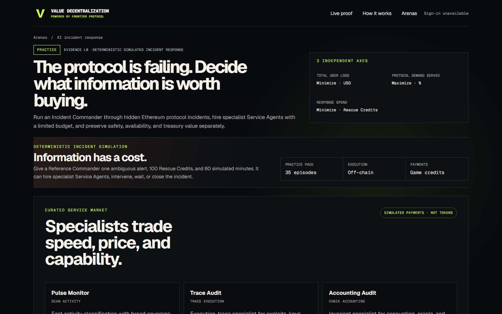
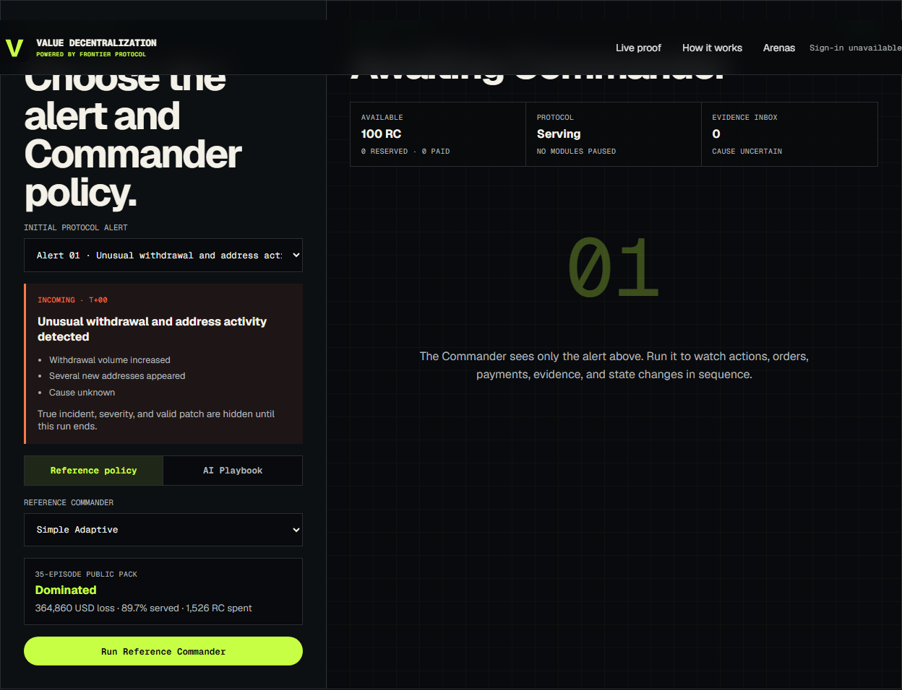
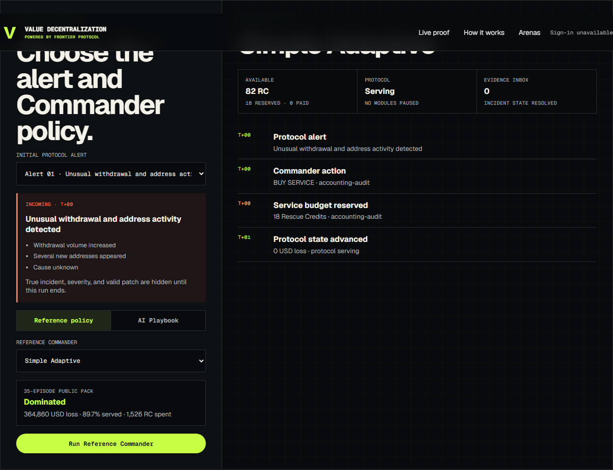
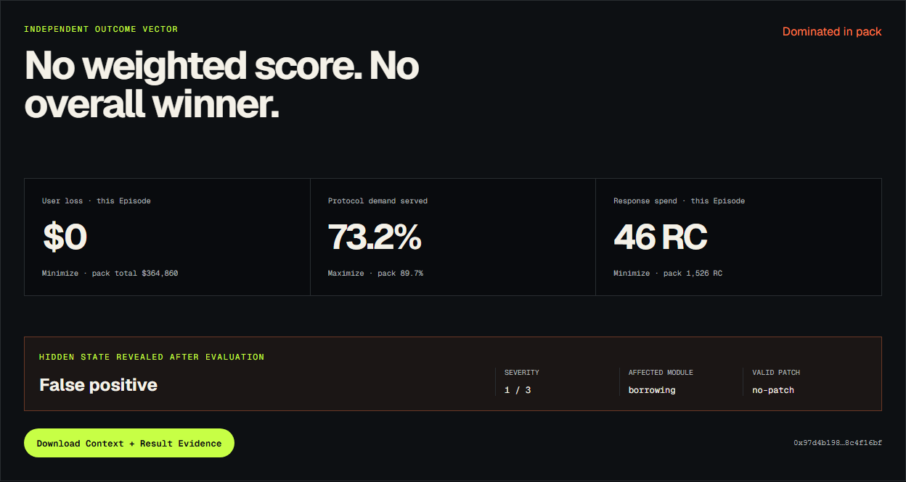
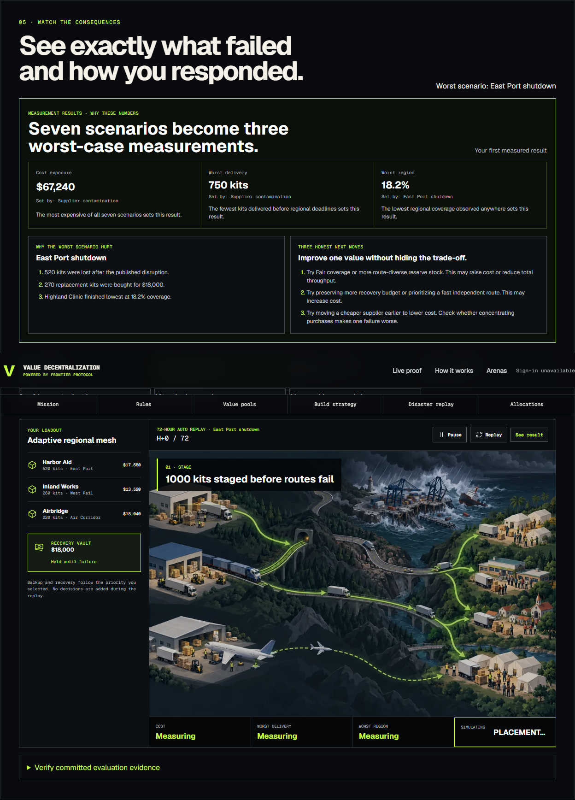
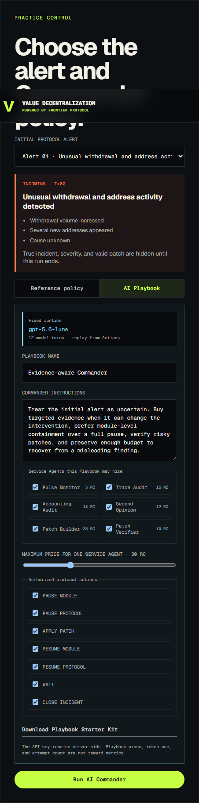
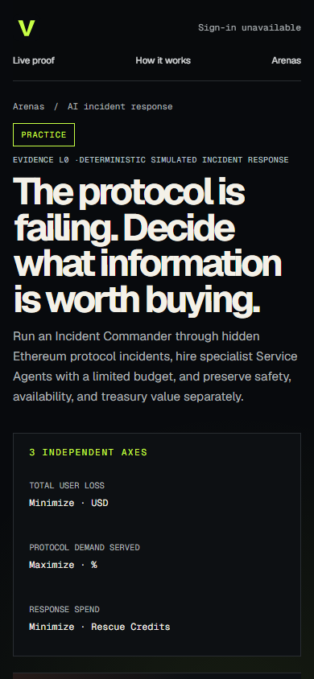

# Rescue Room UXギャップ監査

**監査日:** 2026-09-10

**比較対象:** Emergency Supply / Rescue Room

**範囲:** 初見理解、Practice開始、シミュレーション中、結果理解、AI Playbook、Mobile表示

## 結論

Rescue Roomは機能として動いているが、現状の体験は「Incident Responseゲーム」より「Evaluatorの技術デモ」に近い。Emergency Supplyでは、最初のイラストだけで「経路が壊れ、物資を迂回させるゲーム」と理解でき、結果画面でも「何が失敗し、なぜ3つの数値になったか」が説明される。Rescue Roomには、その2つを担う視覚的な世界モデルと因果説明がない。

最優先は機能追加ではなく、既存のシミュレーターを次の一つの物語として見せることである。

```text
Alert → Commander → Service購入 → Evidence到着 → Pause/Patch判断
      → Protocol状態変化 → 3つの独立Outcome → Value Poolごとの支持
```

## 監査ステップ

### Step 1 — 初見でゲームを理解する

**状態:** Emergency Supplyは良好、Rescue Roomは要改善

Emergency Supplyは、ファーストビュー内に「壊れた港・道路」「倉庫」「迂回する車両」「支援先」が一枚で入り、ゲーム内の因果が文章を読まずに分かる。





Rescue Roomは見出しと3軸は明確だが、Protocol、Commander、Service Agent、資金、Evidenceの関係を示す画像がなく、「何が壊れて、画面内で何が動くゲームか」が分からない。画像要素もロゴ以外に存在しない。



**不足:** Rescue Room版の「Whole game in one picture」。架空ProtocolのModule、攻撃・障害、Commander、Service Agents、支払い、Evidence、Pause/Patch、3 Outcomeを一枚で示す必要がある。

### Step 2 — Incidentを選び、実行する

**状態:** 操作可能だが、開始までの文脈が弱い

Rescue RoomではService Marketが先に6枚並び、その後で初めてAlertとCommanderが出る。DesktopではIncident consoleの開始位置が約1,327px、実行ボタンが約2,209pxであり、最初に読むのは事件ではなくカタログになっている。



Alert、100 RC、60分というルールは存在するが、以下が不足している。

- 「あなたが決めること」と「AIが自律判断すること」の区別
- Actionが時間を進め、Incidentも同時に進行するという説明
- Reference Commanderを試す意味と、AI Playbookを試す意味の違い
- 初心者向けの1クリックGuided Run
- Serviceを購入すると何が分かり、何を失うかの具体例

また、実行前から35 Episode集計の`Dominated`が表示されるため、探索前に答えを見せてしまい、単一Episodeを試す意味を弱めている。

### Step 3 — シミュレーションを見る

**状態:** 動くが、「ログの再生」に留まる

TimelineはAction、予算確保、支払い、Evidence、状態遷移を順番に再生できる。これはEvidenceとしては良い。一方、ゲームとして見えるものはテキスト行だけで、ProtocolやService Agentは画面上に存在しない。



主な不足は次の通り。

- どのProtocol Moduleが危険で、どこがPauseされたかを示すProtocol Map
- 雇ったService Agent、納期、支払状態を示すActive Jobs
- Commander → Serviceへの支払いと、Service → CommanderへのEvidence返却の可視化
- Timelineの現在位置を追う自動スクロール
- 実行中のPause、速度変更、Step実行、結果へSkip
- ActionによってUser Loss・Availability・Budgetがどう変化したかの差分表示

現在のTimelineは`max-height`内をスクロールするが、新Event追加時の自動追従がない。画面上部に古いEventが残り、最新の判断を追いにくい。

さらに、今回のDefault EpisodeではEvidenceが0件の時点で`Incident state resolved`と表示された後も、CommanderがAudit、Pause、Patch購入を続ける。結果は`False positive`なのに途中のAuditは`compromised-key`と断定する。Service Agentが誤る設計自体は面白いが、UIが「誤判定」「信頼度」「Commanderが誤ったEvidenceに従った」を説明しないため、バグまたは物語の矛盾に見える。

### Step 4 — 結果を理解する

**状態:** Outcomeは明確、因果説明が不足

Rescue RoomはUser loss、Demand served、Response spendを独立表示し、Weighted Scoreを作っていない。この部分はValue Decentralizationの原則に沿っている。



しかし、ユーザーには次が分からない。

- なぜDemand servedが73.2%になったか
- 46 RCの内訳と、それが必要だったか
- どのActionがUser Lossを防いだか
- False Positiveに対して何をやり過ぎたか
- 同じAlertで別のCommanderならどうなったか
- 次にPlaybookの何を変更すべきか

Emergency Supplyには`WHY THESE NUMBERS`、`WHY THE WORST SCENARIO HURT`、`THREE HONEST NEXT MOVES`があり、測定結果を次の試行へ接続している。



Rescue Roomにも「3 Outcomeの発生源」「良かった判断」「不要だった判断」「次の3つの改善案」が必要である。総合点は不要だが、因果説明は必要である。

### Step 5 — AI Playbookを作る

**状態:** Expert向け設定としては成立、初回体験としては重い



実AIを動かせることは大きな強み。ただし現在は、生の長文Instructions、6 Service権限、7 Protocol Action権限、価格上限が一度に出る。結果を一度も見ていないユーザーには、何を書けば行動がどう変わるか予測できない。

不足しているものは次の通り。

- `Cautious / Evidence-first / Availability-first`など3つのPlaybook出発点
- 各Playbookが重視するValueと典型Actionのプレビュー
- `Basic / Advanced`の段階分け
- Referenceと自分のAIを同じEpisodeで比較する操作
- Playbook変更点とOutcome差分の履歴
- AIが今考えていることではなく、今どの公開Evidenceを入力として受け取ったかの表示

### Step 6 — Mobileで理解・操作する

**状態:** 横崩れはないが、縦に長く重要操作が遠い

390px幅で両画面とも横Overflowはなかった。一方、Rescue RoomはService 6枚が縦に続いてからIncident Roomへ到達するため、初回操作までのスクロールが長い。小さなMonoラベル、Evidence boundary、価格・納期情報もMobileでは読みづらい。



MobileではService Marketを横スクロールCardまたは折り畳みにし、Alertと実行CTAを先に見せる必要がある。

## 優先順位

### P0 — 次のUX実装で必須

1. Rescue Room版「Whole game in one picture」
2. Protocol Mapを中心にしたLive Incident Stage
3. `Alert → Hire → Evidence → Action → Outcome`の3〜5 Step説明
4. 結果の`WHY THESE NUMBERS / WHAT WENT WRONG / NEXT MOVES`
5. False Positive、誤Evidence、Resolved状態の物語整合性修正
6. 再生中の自動追従、Pause、Step、Skip

### P1 — AI Competitionとして必要

1. 3つのPlaybook PresetとBasic / Advanced分離
2. Reference vs AIの同一Episode比較
3. Service MarketをIncident文脈の中へ移動
4. Current RunのEvidenceを4 Value Poolsがどう評価するか表示
5. Revision間のAction・Outcome差分
6. MobileでAlertとCTAを先に出す

### P2 — Competition化の後

1. Final Entry、Hidden Final、Reward状態のLifecycle表示
2. Agent-to-Agent Escrowの実Tx表示
3. Service Agentの評判・精度履歴

## 推奨する画面順序

```text
1. Hero + Whole game in one picture + Watch a sample incident
2. Alert / Protocol Map / Commander / Service Marketを一つのIncident Consoleへ統合
3. Live simulation with Pause / Step / Skip
4. Outcome explanation + Reference comparison + Next moves
5. Value Poolsが同じEvidenceを別々に評価
6. Advanced Playbook editor / Evidence download
```

## 現在すでに良いもの

- 3 Outcomeを独立させ、Weighted Scoreを作っていない
- Simulated paymentとTokenを明確に区別している
- Serviceの価格と納期が比較可能
- Action、Payment、Evidence、Protocol StateをReplayできる
- Alert、Control、Timeline、Resultの基本的な情報構造は存在する
- Desktop / Mobileとも横OverflowとConsole Errorは確認されなかった

## 検証範囲の限界

Desktop 1440×900とMobile 390×844で初期表示、Reference実行、結果、AI Playbook表示を確認した。Screen readerでの実読み上げ、色コントラストの数値測定、200% Zoom、実AI実行待ち中の長時間状態は今回の範囲外である。`aria-live`領域へ短時間に多数のEventが追加されるため、読み上げ過多の可能性は別途確認が必要である。
